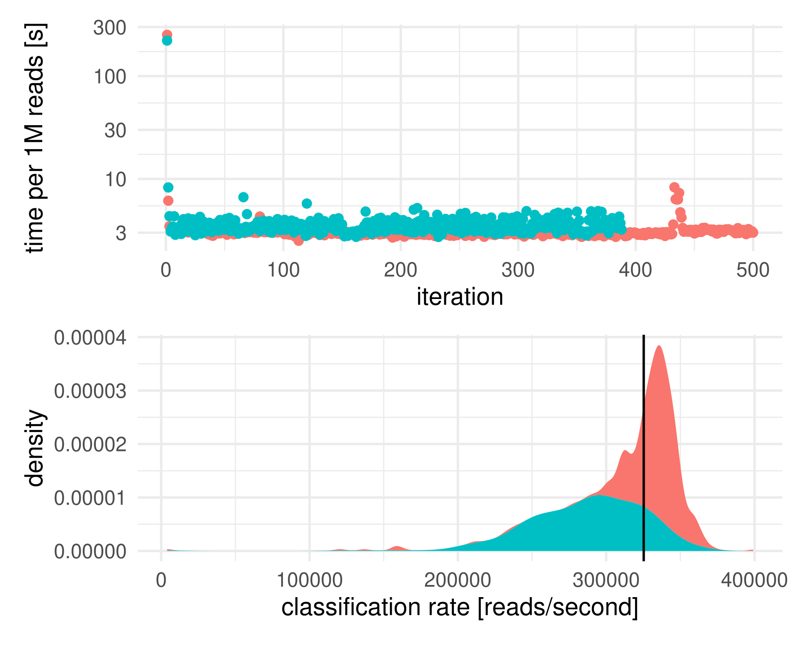

# Local memory cashing of the MEDI DB

For large Kraken2 databases like in MEDI reading the database into memory will quickly becoming the
largest time sink when classifying. When running many Kraken2 jobs in parallel this can
be circumvented by using shared memory where the first Kraken2 job will load the database
into a memory segment readable by all Kraken2 jobs. This will often show up as "cached"
in your memory overviews. As long as this cached segment is not freed by the OS, databases
will be loaded instantaneously by all future Kraken2 jobs. This will lead to immense performance gains.

This will usually not work for HPC systems as the jobs will be distributed across different
machines with their own memory and RAM. This is why the Kraken2 steps here allow batching
of Kraken2 jobs into groups that are guaranteed to run on the same machine and thus will
gain the performance benefit. The caveat here is that all jobs in a batch will fail together.
So if one of the Kraken2 jobs crashes all output from the batch is lost.

## Choosing an optimal batch size

In practice, one will aim to make the batch as large as possible while still retaining some resilience for failing jobs.

For single machines/servers the optimal batch size is 1, because the DB will be cached across
all MEDI runs on this machine.

For large HPC systems the goal is to distribute a large number of samples evenly across all
available nodes with sufficient memory. For instance, if you have 3 nodes with 500+ GB of RAM
and need to process 1,200 files we would set the batch size to 400. However, because the expected speed-up is in the order of 100x one should also aim to allocate at least 100 samples per node. So if you are only processing <100 samples we recommend to use a batch size
of 100 and run them on a single node as this is the most efficient.

> [!NOTE]
> For single machine setups the optimal batch size is always 1.

## Benchmarks

For 888 samples from the METACARDIS cohort, those were the running times on two nodes
using 6 CPUs each (500 samples on node 1 [red], and 388 samples on node 2 [blue]).

The caching brings the amortized classification rate to >300K reads/s. The naive classification has a rate of ~3,500 reads/s. So you gain close to 100x speed-up with
the db caching.